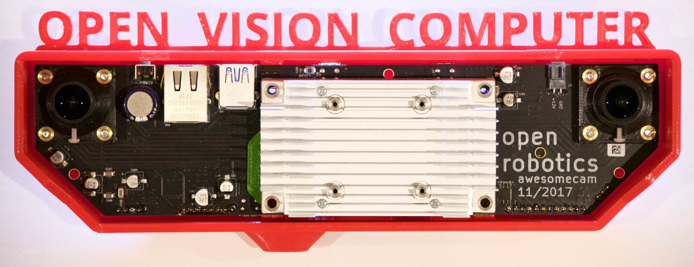
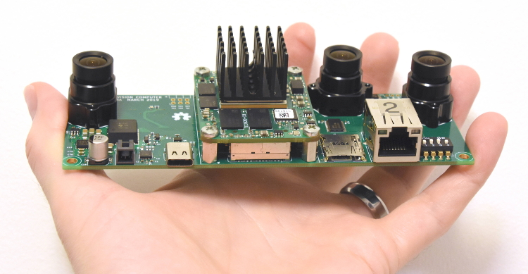
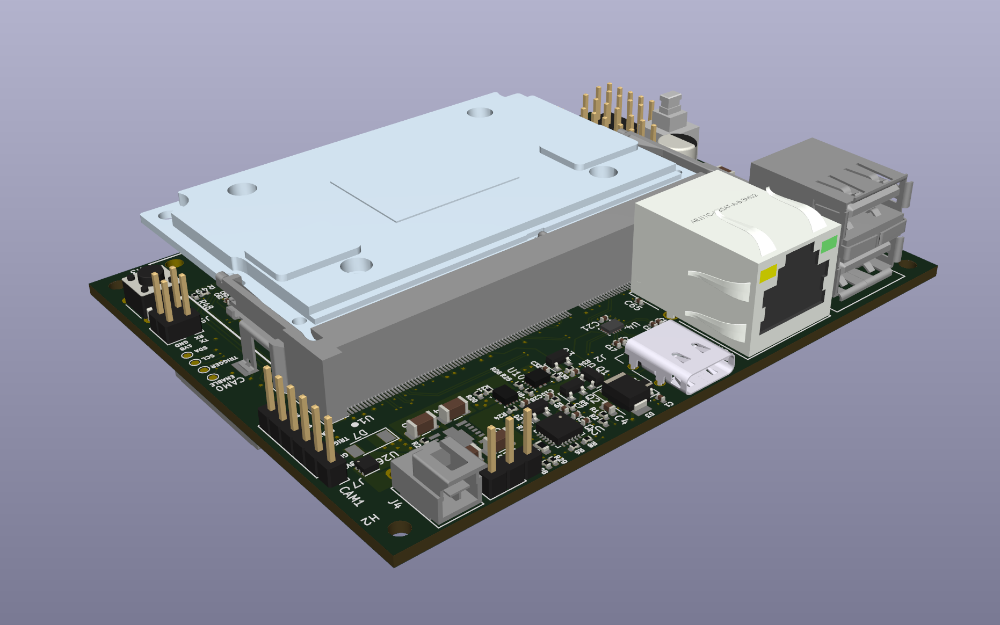
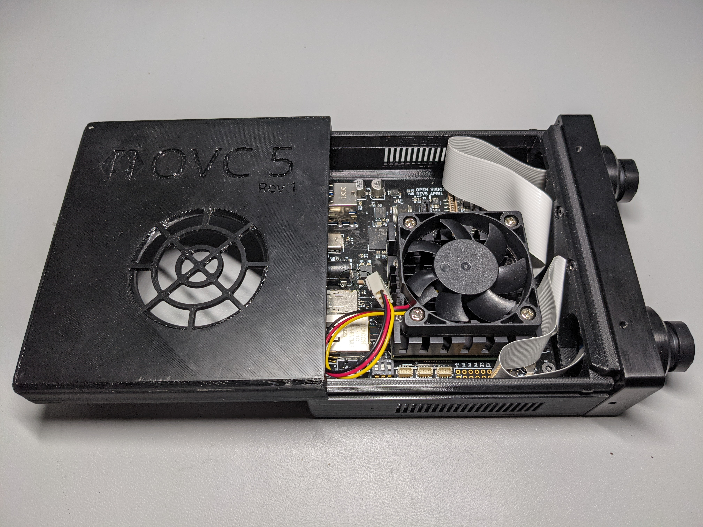
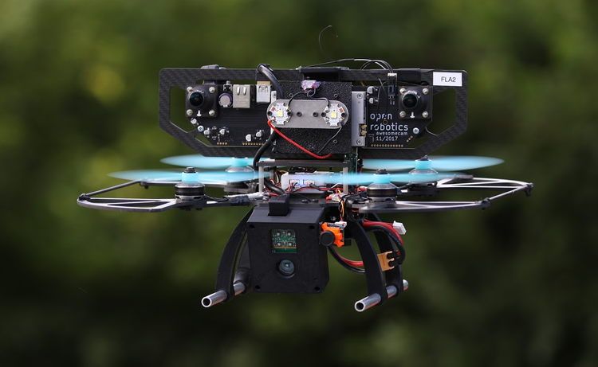

# The Open Vision Computer

The Open Vision Computer (OVC) was designed to support high speed, vision
guided autonomous drone flight. In particular our aim was to develop a system
that would be suitable for relatively small-scale flying platforms where size,
weight, power consumption and computational performance were all important
considerations. Our recently submitted manuscript describes the primary features of our OVC
system and explains how they are used to support fully autonomous indoor
and outdoor exploration and navigation operations on our Falcon 250
quadrotor platform. This manuscript can be found on
[arXiv](https://arxiv.org/abs/1809.07674v1).

## OVC1

## OVC2

## OVC3

## OVC4

## OVC5

## [Software Resources](./software.html)

We have made many of our software repositories publicly available, and have been
successfully used on our OVC platforms. We currently have many vision related
tools such as stereo camera rectification, GPU accelerated depth estimation,
deep learning based object segmentation etc.

## [Hardware Resources](./hardware.html)

All resources required to manufacture and assemble these devices is publicly
available on our GitHub repository.

## Media

#### The Open Vision Computer
A brief walkthrough video of the features of the OVC, and it's application to
unmanned aerial vehicles such as the Fast Lightweight Autonomy Falcon 250.

#### DARPA Fast Lightweight Autonomy
Project overview of the DARPA Fast Lightweight Autonomy programme, featuring our
unmanned aerial vehicle platform powered by the Open Vision Computer.

### Falcon 250 with the OVC

