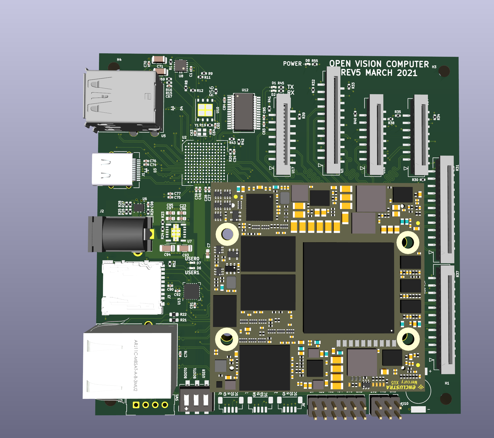

# ovc5

## Directory Summary
* __Hardware__: PCB schematic and layout is here. This project uses `kicad-nightly`.
* __Firmware__: FPGA source is located here. This project uses the Xilinx Ultrascale+ chipset. Vivado is used to design and export the bitstream that executes on the FPGA.
* __Scripts__: These are convenience scripts for automating large portions of the setup and run-time process.
* __Software__: Software that runs on the host and the arm core to pass sensor information.

## Setup Process
1. After assembling OVC5, use the [provisioning script](https://github.com/osrf/ovc/blob/master/ovc5/scripts/install_sd.sh) to generate an SD card image. This can then be loaded into the OVC5 device port.
2. Connect power and ethernet to the device. The ethernet should be connected to the same LAN as your computer.
3. Connect the OVC5 to a USB3 Super Speed port. This will provide the correct bandwidth for streaming high resolution/framerate images.
4. Wait a minute or two and run `ssh root@zynq.local`. You may also attempt to ping it until it responds. The default password, as defined in the provisioning script, is `temppwd`.
5. Once connected, initialize ethernet over usb using the script located in the home directory [`init_usb_ethernet.sh`](https://github.com/osrf/ovc/blob/master/ovc5/scripts/device_scripts/init_usb_ethernet.sh)
6. Use `git` to clone in the latest OVC version. Now compile the [camera device driver](https://github.com/osrf/ovc/tree/master/ovc5/software/camera_device_driver).
7. On the host machine, compile the [camera host driver](https://github.com/osrf/ovc/tree/master/ovc5/software/camera_host_driver).

## Execution
1. On the host machine, run `ovc5_host_node`. This creates a server for OVC5 to connect to.
2. On OVC5 (via ssh), run `ovc5_driver`. This connects to the host server and immediately starts streaming sensor data.
3. To stop execution, use `ctrl + C`. Always stop execution on the device first otherwise sensors will not be reset properly. This can cause abnormal behavior in the following execution (unless power is reset or the script is properly exited in the following execution).

## Renders

