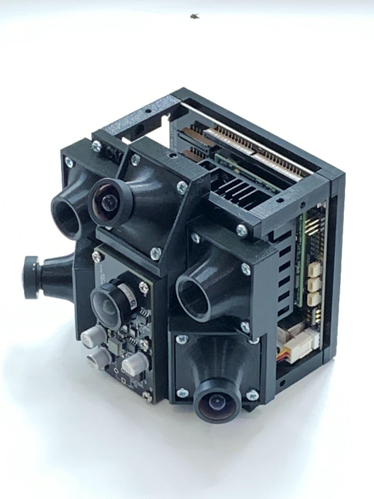

# ovc5

The OVC5 is basically a 6 port USB3 Gen 2 (10 Gbps) hub with the following devices:
* 2x USB3 Gen 1 (5 Gbps) ethernet over USB devices, assigned to subnets 10.0.1.x and 10.0.2.x, connected to the Zynq and used to stream the imagers in parallel.
* 2x USB3 Gen 2 (10 Gbps) ports available for connection to third party devices, currently because of hardware quirks they are one USB A (on the top connector) and one USB C.
* 1x USB2 device connected to the onboard FTDI chip for serial debugging of the Zynq.
* 1x unused port (not routed).
* 3x Extra connectors following the STEMMA / QWIIC standard for quick integration of external devices.

It is also fully modular and any configuration of sensors can be plugged to the MIPI connectors, they will be detected at runtime and streamed over USB, provided a driver has been written for them, a reference driver is provided for the PI camera v2 based on IMX219.
The idea is that OVC5 can be a single sensor integration center for mobile robot applications (i.e. robot heads) which can synchronize and stream up to 10 Gbps of heterogeneous data coming from a variety of sensors over a single USB connection. Since OVC5 is a USB hub and exposes two downstream ports while only using one, it actually increases the number of ports available to whatever processing system it connects to, rather than decreasing it.

## Directory Summary
* __Hardware__: PCB schematic and layout is here. This project uses `kicad-nightly`.
* __Firmware__: FPGA source is located here. This project uses the Xilinx Ultrascale+ chipset. Vivado is used to design and export the bitstream that executes on the FPGA.
* __Scripts__: These are convenience scripts for automating large portions of the setup and run-time process.
* __Software__: Software that runs on the host and the arm core to pass sensor information.

## Setup Process
1. After assembling OVC5, use the [provisioning script](https://github.com/osrf/ovc/blob/master/ovc5/scripts/install_sd.sh) to generate an SD card image. This can then be loaded into the OVC5 device port.
2. Connect power and (optionally ethernet) to the device. The ethernet should be connected to the same LAN as your computer.
3. Connect the OVC5 to a USB3 Super Speed (preferably 10Gbps capable) port. This will provide the correct bandwidth for streaming high resolution/framerate images. Because of a quirk in the USB hub chip and its flexconnect feature not quite working yet, you will need to connect using a USB 3 A-A cable to the _bottom_ connector of the USB A stack (the one closer to the PCB).
4. Wait a minute or two and run `ssh root@zynq.local`. You may also attempt to ping it until it responds.
    * The default password, as defined in the provisioning script, is `temppwd`.
5. USB Ethernet should be already up (you can check by running `ip a` on your host machine. If it isn't you can initialize it manually by running the startup script located in the home directory [`startup.sh`](https://github.com/osrf/ovc/blob/master/ovc5/scripts/startup.sh)
6. Use `git` to clone in the latest OVC version. Now compile the [camera device driver](https://github.com/osrf/ovc/tree/master/ovc5/software/camera_device_driver).
7. On the host machine, compile [`libovc`](https://github.com/osrf/ovc/tree/master/ovc5/software/libovc) and the [camera host driver](https://github.com/osrf/ovc/tree/master/ovc5/software/camera_host_driver). This can be accomplished using the [`Makefile`](https://github.com/osrf/ovc/blob/master/ovc5/software/Makefile).
    * __NOTE__: the makefile `all` target compiles the camera driver as well. This is just to sanity check when not editing on an OVC device. Remove `device_driver` from all or install `i2c-tools` to not fail this build step.

## Execution
1. On the host machine, run `make run_host`. This creates a server for OVC5 to connect to.
2. On OVC5 (via ssh), run (from software) `./camera_device_driver/build/ovc5_driver`. This connects to the host server and immediately starts streaming sensor data.
3. To stop execution, use `ctrl + C`. Always stop execution on the device first otherwise sensors will not be reset properly. This can cause abnormal behavior in the following execution (unless power is reset or the script is properly exited in the following execution).

## Renders

## Pictures

